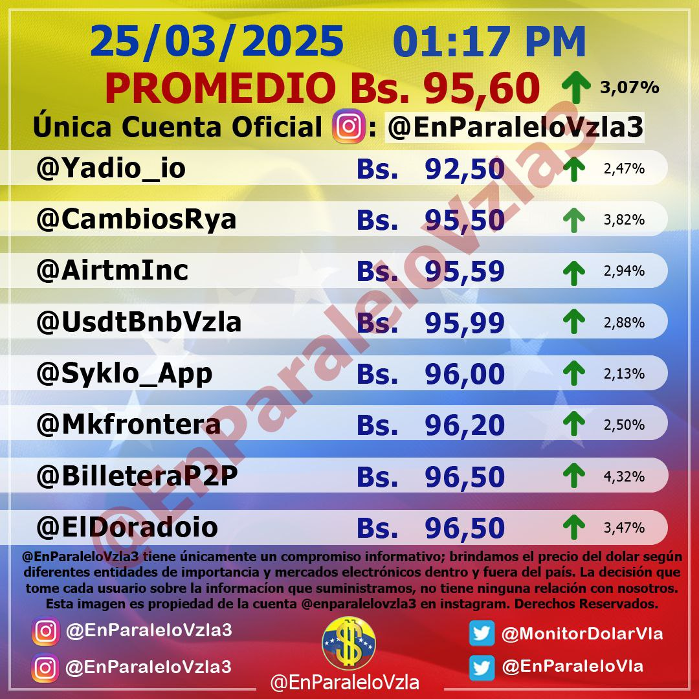
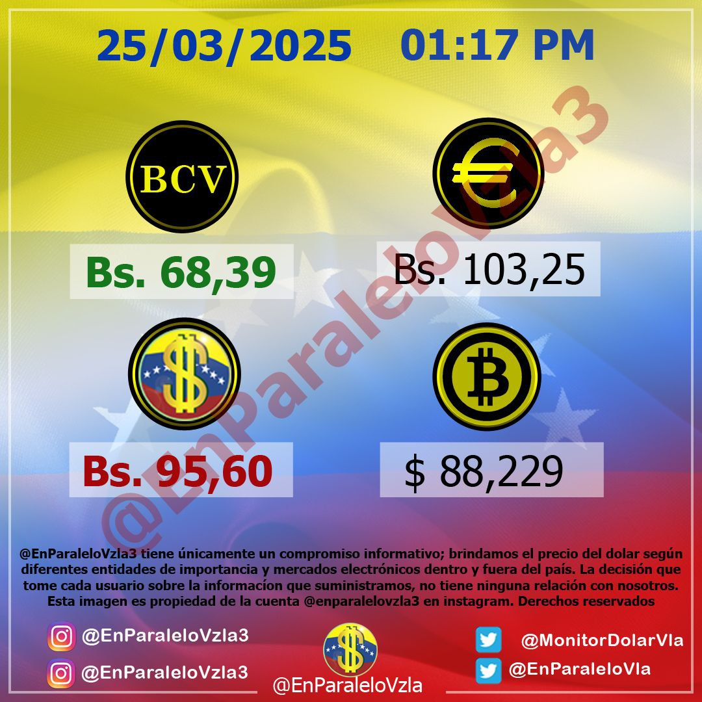

# Rate Reader EnParaleloVzla


API de procesamiento de imágenes diseñada para la identificación y extracción automatizada de tasas de cambio del dólar paralelo en Venezuela, mediante técnicas de:

- Reconocimiento Óptico de Caracteres (OCR) con implementación del motor [Tesseract](https://github.com/tesseract-ocr/tesseract)
- AI con Gemini para validación y análisis contextual (opcional)

### Ejecución con Docker
```bash
# Construir la imagen
docker build -t rate-reader-epv .

# Ejecutar el contenedor
docker run -d -p 14924:14924 --name rate_reader rate-reader-epv
```

## Endpoints

### `GET /api/docs`

### `POST /api/reader`

En este endpoint se envía una imagen de la tasa de cambio del dólar paralelo en Venezuela, y se obtiene la tasa de cambio en formato JSON.

#### Request

```json
{
    "file": "bytes",
    "type_img": "image-1|image-2|null"
}
```

## Tipo de imágenes

### `image-1`

Es la imagen principal que refleja la tasa de cambio del dólar paralelo y sus fuentes.



### `image-2`

Es la imagen secundaria que refleja el precio de dolar BCV, Euro y Bitcoin.

